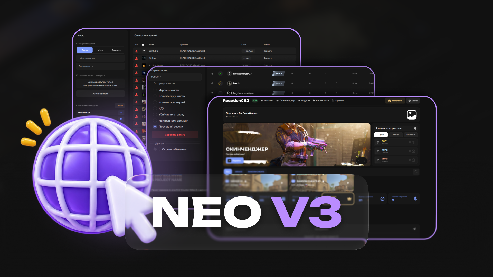

# Шаблон Neo v3 - LR Web

Современный форк движка для вашего сайта с приятным и удобным дизайном.

## ⚙️ Системные требования

> 🔥 **Важно:** для корректной работы шаблона на хостинге необходимо использовать **PHP 7.4**.
>
> Работа на других версиях PHP **не гарантируется**.

## 🚀 Установка

Установка занимает несколько шагов:

1. **Проверьте PHP**
   Убедитесь, что на хостинге установлена версия **PHP 7.4**.

2. **Загрузите файлы**
   Распакуйте архив и загрузите все файлы в **корневую папку сайта**.

3. **Настройте права доступа**
   Выставьте необходимые права на файлы и папки согласно инструкции.

4. **Запустите установщик**
   Откройте сайт в браузере и следуйте инструкциям встроенного веб-установщика.

📖 **[Подробная инструкция по установке](https://slame.gitbook.io)**

## 🔑 Что потребуется

Для работы шаблона необходимо:

* **PHP 7.4**
* **Steam Web API Key**
* доступ к файлам сайта и базе данных

## 🆚 Отличия от предыдущих версий

Хотите узнать, чем **Neo v3** отличается от предыдущих шаблонов?

👉 **[Сравнение Neo и Rich](https://slame.gitbook.io/nl/otlichiya/shablony-neo-vs-rich)**

## 📚 Полезные ссылки

* 📖 **[Документация](https://slame.gitbook.io)**
* 🆚 **[Сравнение шаблонов Neo и Rich](https://slame.gitbook.io/nl/otlichiya/shablony-neo-vs-rich)**

> 💡 **Совет:** перед установкой рекомендуется полностью ознакомиться с документацией, особенно если на сайте уже используется **IKS ADMIN v3**.
